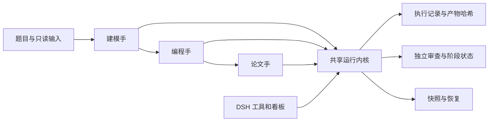

# Math Modeling Workbench

**通用数学建模 Skill，共享证据与执行内核，DeepSeek Harness 桌面适配。**

由 [Wuyanqiao/math-modeling-skill](https://github.com/Wuyanqiao/math-modeling-skill) 维护，基于 [XiaoMaColtAI/math-modeling-skill](https://github.com/XiaoMaColtAI/math-modeling-skill) 的三阶段知识与工具升级。当前本地开发版本 **2.0.0**；来源与授权状态见 [第三方说明](THIRD_PARTY_NOTICES.md)。

## 能力与结构

Agent 负责理解题目、设计模型、编程求解和写作；本项目提供渐进加载的知识、算法示例、实际执行和证据检查。不同宿主使用同一项目状态，DSH 提供工具和看板。



- **通用 Skill**：完整或单阶段任务，模型、代码、论文规范按需加载。
- **执行与证据**：argv 命令、输入/代码/输出哈希、参数、种子声明、退出码、日志；结论关联真实产物。
- **阶段审核**：M1 模型、P1 最小求解、P2 结果、W1 证据大纲、W2 论文；单阶段只要求对应门禁。
- **变化失效**：文件增删改后旧审核失效，空产物不能参与完成判定。
- **配置与恢复**：balanced/short/competition profile；硬规则须有来源；原子状态、迁移备份、不可覆盖快照和恢复预览。
- **DSH**：会话与项目绑定、能力/阻塞、审核、执行、预览与快照入口，业务规则委托共享 CLI。
- **科学质量**：算法卡片、确定性数值基准、CV 内预处理；检索服务失败与零结果分开，元数据匹配与原文支持分开。

文件结构、退出码和来源匹配都不能单独证明科学结论或排版正确。未获宿主独立认证的审核身份明确标为 declared，不能把作者自检伪装为独立通过。

## 开始使用

Python 3.11–3.13；基础内核只依赖标准库，科学计算和文档能力按需安装。见 [安装说明](docs/installation.md)。

```powershell
git clone --branch WuYanqiao/universal-upgrade https://github.com/Wuyanqiao/math-modeling-skill.git
Set-Location math-modeling-skill
python -m venv .venv
.\.venv\Scripts\Activate.ps1
python -m pip install -e ".[science,figure,docx,pdf,validation]"
```

将仓库作为 Skill 加载到宿主，入口 [SKILL.md](SKILL.md)。题目目录与软件仓库分离：

```powershell
$skillRoot = (Get-Location).Path
$projectRoot = Join-Path (Split-Path $skillRoot -Parent) 'my-modeling-project'
New-Item -ItemType Directory -Path $projectRoot -Force | Out-Null
python "$skillRoot/scripts/mathmodel.py" init --project-root $projectRoot --options '{"scope":"full","profile":"balanced","paper_format":"word"}'
python "$skillRoot/scripts/mathmodel.py" doctor --project-root $projectRoot
python "$skillRoot/scripts/mathmodel.py" state --project-root $projectRoot
```

安装后也可用 mathmodel 或 python -m mathmodel_runtime，三个入口共用实现。初始化不会自动求解，Agent 仍须读取题面并实现模型。

当前升级位于 `WuYanqiao/universal-upgrade`，审查入口为 [PR #2](https://github.com/Wuyanqiao/math-modeling-skill/pull/2)。`main` 保留本次同步后的上游基线，合入升级前请使用上述分支命令。

给 Agent 的请求示例：

> 使用 math-modeling Skill 分析这道题并用 Python 求解，先跑最小例子，再根据验证结果扩展。默认只交付 Word，按真实证据选择图表，记录运行与审核状态。

> 只检查现有模型与结果，使用 short profile，不补写整篇论文。把结论与代码、结果表关联，保存一个可恢复快照。

## 运行接口

完整字段见 [RUNTIME_API.md](RUNTIME_API.md)，阶段步骤见 [共享运行时](references/共享运行时.md)。

| 动作 | 用途 |
|---|---|
| init / state / doctor | 初始化、恢复和能力检查 |
| phase / todo | 按范围推进与维护清单 |
| run | 在声明文件副本中执行 argv，记录结果并发布成功输出 |
| artifact-add / claim-add | 产物来源与结论证据 |
| gate-prepare / gate-record | 审核快照与真实回执 |
| validate / complete | 实际产物与当前任务完成条件 |
| checkpoint-create / checkpoint-list / checkpoint-restore | 不可覆盖版本、恢复预览 |
| artifact-read / run-log-read | 在授权项目范围内读取已登记产物和真实运行日志 |

run 的 code、inputs、outputs 是明确路径数组，需包含脚本所需辅助文件。相对路径从执行副本解析；此机制不是操作系统安全沙箱，宿主仍执行文件、网络和命令权限。运行时不自动安装依赖、上传论文或填写审核 PASS。

## DeepSeek Harness

按 [DSH 集成说明](dsh-plugin/README.md) 使用与目标宿主兼容的组合包。CLI、脚本、模板和知识库由单一来源生成；Python 包、TeX 等外部工具由 doctor 检查。

适配保留 mm_project_init、mm_state、mm_phase_enter、mm_gate、mm_todo、mm_check_deliverables、mm_complete 等入口，并增加运行、证据、快照、预览。所有项目操作继承宿主授权；被拒绝的宿主操作不会改走 Node 文件接口。

具体宿主版本和真实挂载验证范围以集成说明与 [升级验证记录](docs/upgrade-verification.md) 为准，Node 模拟测试不等于任意版本桌面宿主均已验证。

## 验证与本地分发

```powershell
python -m pip install -r requirements-dev.txt
python -m unittest discover -s tests -v
python tools/docx/scripts/self_check.py
python benchmarks/run_baselines.py
node --test tests/dsh/*.test.mjs
python scripts/sync_dsh_plugin.py --apply
python scripts/sync_dsh_plugin.py --check
python scripts/build_distribution.py --mode local-development --output dist
```

[数值基准](benchmarks/README.md) 包括合成线性优化、时间顺序预测和 TOPSIS，提供已知答案及容差，不冒充真实赛题效果。CI 配置覆盖 Windows/Linux、Python 3.11/3.13、Node 22/24；配置存在不代表远端已执行。

本地包名包含 LOCAL-DEVELOPMENT，记录来源提交、工作区状态、逐文件哈希与依赖。上游根项目授权仍待明确，部分继承工具带限制条款，release 构建会阻止未经核实的再分发。具体状态在 [分发策略](distribution-policy.json) 与 [第三方说明](THIRD_PARTY_NOTICES.md)，不能用新许可证覆盖旧条款。

## 维护与来源

保留上游提交历史、三角色方法与算法/工具来源。升级记录见 [CHANGELOG.md](CHANGELOG.md)，贡献说明见 [CONTRIBUTING.md](CONTRIBUTING.md)，使用边界见 [使用指南](使用指南.md)。

origin 指向自己的仓库，upstream 指向原项目。有独立改动后使用同步分支合并上游并跑回归，不强制覆盖自己的主分支。
