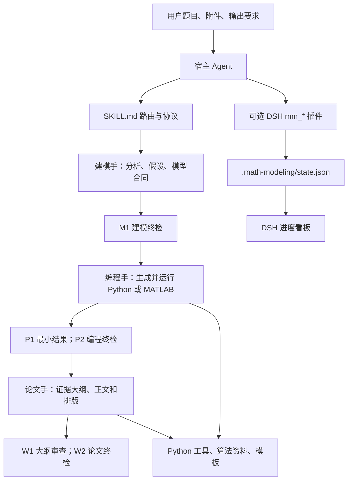

# Math Modeling Skill 实现与运行分析

审查日期：2026-09-22。基线：`3c4bd1927663327812665941a445281b9c008a78`。产品方向按用户要求：通用 Skill 为主，多 Agent 兼容，DSH 桌面专项增强。

## 1. 判断

这个项目适合作为知识与工具基线：三角色流程清楚，文档生成、公式转换、资源哈希绑定和部分科学绘图工具已有实际实现及回归测试。当前最值得升级的是**跨宿主执行的一致性、真实交付校验和可复现安装**。

它主要是由 Agent 解释执行的 Skill 知识库，加一组 Python/MATLAB 工具和一个 DSH 插件。没有独立求解服务或统一的通用工作流运行时；数学模型和求解代码仍由宿主中的 Agent 根据题目生成。三角色并不意味着同时运行三个固定 Agent，独立 Subagent 主要承担阶段验收。

## 2. 克隆与同步状态

| 项目 | 实际状态 |
|---|---|
| 本地目录 | `D:\Users\Cowork_Project\DeepSeekHarnessworkspace\math-skills-update` |
| origin | `https://github.com/Wuyanqiao/math-modeling-skill.git` |
| upstream | `https://github.com/XiaoMaColtAI/math-modeling-skill.git` |
| 克隆时 fork | `2a1556e1d4d65c43896ccf2473e27dd139c6fed0`，无独有提交，落后 16 个提交 |
| 同步后 | fork/main、本地 main、upstream/main 均为审查基线 SHA |
| GitHub 复核 | `status=identical`，`ahead_by=0`，`behind_by=0` |
| 当前分析分支 | `codex/project-assessment`，基于同步后的提交 |
| 源码改动 | 无；仅新增 `project-review/` 分析产物 |

这 16 个提交包括 Star 图更新，以及流程图、符号表、附录代码规范等改动。上游已有总体建模流程图能力要求，不应将“添加流程图”当成从零补齐的功能。版本文件仍为 `1.3.0`；`CHANGELOG.md:5` 记录了尚未发行的更新。[基线提交](https://github.com/XiaoMaColtAI/math-modeling-skill/commit/3c4bd1927663327812665941a445281b9c008a78)

## 3. 实际架构



| 组成 | 入口与实现 | 实际职责 |
|---|---|---|
| 主 Skill | `SKILL.md:24`、`references/README.md` | 意图路由、产物约定、独立审查、按需加载 |
| 角色 | `references/roles/{建模手,编程手,论文手}/SKILL.md` | 阶段知识与工作规范；不是三个固定执行进程 |
| 算法知识 | `references/算法索引.md`、`assets/*.md` | 七大类方法说明与示例代码；主要由 Agent 读取和改写 |
| 依赖和复现 | `references/roles/编程手/scripts/check_env.py`、`repro_manifest.py` | 按功能检查依赖；保存输入哈希、随机种子、参数、命令及环境 |
| 图表 | `tools/figure/scripts/` | 数据剖析、样式、导出、源码与成图检查；代码检查不等于结论正确 |
| 文献 | `tools/paper_search/scripts/hybrid_scholar.py` | 并行调用 OpenAlex 与 AnySearch，融合 DOI/题名和来源元数据 |
| Word | `tools/docx/scripts/equations.py`、`paper_format.py` | OMML 公式、文档样式、转换和格式/结构检查 |
| LaTeX | `tools/latex/scripts/latex_paper.py` | 模板初始化、资源绑定、隔离构建、PDF 与哈希检查 |
| DSH 工作流 | `dsh-plugin/math-modeling-agent/plugins/math-modeling.js` | 注册 `mm_*`、保存阶段/任务/门禁状态、检查部分交付条件 |
| DSH UI | `dsh-plugin/math-modeling-agent/plugins/dsh-math-modeling-ui/` 下的 `lib/index.js` 与 `client/client.js` | 宿主 RPC 读取状态，客户端展示进度和开关 |
| 分发同步 | `scripts/sync_dsh_plugin.py` | 复制 Skill/角色/算法；`tools/` 只复制 SKILL.md |

值得保留的设计与工具能力包括：可单独执行一个阶段、先最小求解再全量实验、作者自检与独立审查分开、真实运行后写作、模板溯源、DOCX/PDF 构建结果与源文件绑定、保留截止时间前的可交付快照。其中快照保护等要求目前主要写在协议中，尚未成为通用运行时能力。

## 4. 怎样运行

### 通用 Agent 方式

将 Skill 按宿主方式注册或加载，并在另一个题目目录中执行任务。仓库是 `SKILL_ROOT`，题目与结果目录是 `PROJECT_ROOT`；本项目已有部分脚本会拒绝将论文和复现产物写入 Skill 根目录。

Agent 先读取根 Skill，再按当前阶段加载角色和工具说明。实际计算由 Python/MATLAB 执行；格式转换、绘图、渲染依赖相应本机工具。没有一个 `npm start` 或“启动整个数学建模应用”的命令。README 的适用 Agent 列表是加载方式说明，本次没有逐宿主验证其完整工作流。

代表性命令应使用可定位的脚本路径，例如：

```powershell
$skillRoot = 'D:\Users\Cowork_Project\DeepSeekHarnessworkspace\math-skills-update'
python "$skillRoot/references/roles/编程手/scripts/check_env.py" --features data visualization optimization
python "$skillRoot/tools/latex/scripts/latex_paper.py" doctor --engine xelatex --need-pandoc
python "$skillRoot/tools/paper_search/scripts/hybrid_scholar.py" --query 'robust optimization vehicle routing' --limit 10 --json
```

最后一条是联网检索的使用示例，本次未调用搜索服务。各功能依赖没有集中声明为一个可复现安装包，当前需按工具说明准备。

### DeepSeek Harness 方式

按照 `dsh-plugin/README.md` 把 `math-modeling-agent` 复制为 DSH 预设，再在新会话中选择该预设。`agent.cordis.yml` 挂载宿主工具和本地插件；插件通过 `import.meta.url` 找内置知识库，注册 `mm_project_init`、`mm_phase_enter`、`mm_gate`、`mm_todo`、`mm_check_deliverables`、`mm_complete` 等工具。

一次典型流程为：初始化项目 → 加载建模角色 → 生成并审核模型 → 编程与运行 → 审核代码及结果 → 论文生成与审核 → 完成检查。`mm_gate prepare` 只生成审查任务说明，实际派发独立 Agent 仍由宿主和主 Agent 执行；`record` 接收返回的回执。状态保存到题目目录 `.math-modeling/state.json`。

**现有 DSH 分发包只带工具说明，缺少多项可执行脚本。** 可整体搬走的知识库和插件不等于完整运行工具链。本次没有向用户 DSH 配置目录安装或挂载预设。

## 5. 实测结果与边界

| 检查 | 结果 | 证据 |
|---|---|---|
| 原始环境 unittest | 117 个发现项，3 个失败、1 个导入错误 | `logs/unittest.log` |
| 隔离环境 unittest | **120 项通过** | `logs/unittest-isolated.log` |
| DOCX self_check | 原始环境失败；隔离补齐依赖后通过 | `logs/docx-self-check*.log` |
| data/visualization/optimization 依赖 | 通过 | `logs/python-env.json` |
| LaTeX doctor | 所选引擎和 Pandoc/PDF 工具检查通过 | `logs/latex-doctor.json` |
| Python 编译检查 | 通过 | `logs/python-compile.log` |
| DSH 三个 JS 文件语法 | 通过 `node --check` | `baseline.json` |
| 内置知识库同步 | 在现有同步规则内一致 | `logs/bundle-sync.log` |
| DSH 行为 | 隔离模拟复现多个缺陷 | `logs/dsh-probes.json`、`DSH_AUDIT.md` |

原始环境缺少 `defusedxml`，导致 DOCX 模块导入和自检失败，但 `tools/docx/scripts/check_env.py:13` 只检查 `docx`、`lxml`。三项初始测试失败是 Windows `RENAIS~1` 短路径与 `Renaissance2` 长路径的断言差异；规范临时根路径后消失，不应误报成三项转换功能损坏。

本次 Python 为 3.13.13，Node 为 v24.11.1。复测使用继承系统包的本地 venv，只额外安装 `defusedxml==0.7.1`，没有证明全新机器能按现有说明一次安装成功。中途一次把测试临时目录放进 Skill 仓库，触发了源码写入保护，已改为仓库外目录；该次日志保留供审计，不计入上游缺陷。

这些检查未覆盖完整赛题求解、真实 DSH 桌面安装/多会话生命周期、联网文献服务、完整论文的真实编译渲染，也未覆盖 Linux/macOS。120 项通过说明已有回归场景通过；例如 `tests/test_subagent_protocol.py` 主要检查文档包含指定语句，并不证明 DSH 实际门禁无法绕过。

## 6. 优先修复的实现问题

以下 P1 表示应进入第一批工程修复，P2 表示后续改善；DSH 行为的证据范围是模拟宿主，详见专项报告。

| 优先级 | 问题与源码证据 | 影响与处理方向 |
|---|---|---|
| P1 | `repro_manifest.py:51` 把哈希放在 `input_files[].sha256`，而 `math-modeling.js:517` 仅匹配顶层键 | 真实脚本生成的官方清单被插件误报缺输入 SHA-256；应共享 JSON Schema，并做生产者→消费者契约测试 |
| P1 | `math-modeling.js:409` 的回执只校验字段、状态和非空 evidence；无前置门禁、独立 reviewer 或证据快照绑定检查 | 模拟中前四门禁 pending、回执有 P0，W2 仍可记录 PASS。建立回执 schema、前置关系与审查身份/快照校验 |
| P1 | `math-modeling.js:486` 多以文件存在和后缀判定交付 | 空白代码、图、DOCX 和空值复现字段可参与完成判定。调用真实文档/图/运行校验并验证字段值 |
| P1 | `math-modeling.js:574` 只比较旧快照中仍存在的文件；`:583` 只在成功时设置 completed | 增删文件不产生漂移；后续被阻塞时旧完成标记仍为 true。比较文件集合和哈希，失败时撤销完成状态并失效相关门禁 |
| P1 | `math-modeling.js:90` 缓存工作根目录；显式 projectRoot 没有一致传递 | 模拟同插件实例切换工作目录会读回旧项目，显式根目录下一次调用丢失。用项目/会话键隔离状态，增加真实多会话测试 |
| P1 | `scripts/sync_dsh_plugin.py:14` 只同步工具入口文档 | DSH 独立包缺少图表、DOCX、LaTeX、论文搜索脚本。发布时验证全部本地资源引用及最小执行链 |
| P1 | DOCX 环境检查漏报依赖；仓库没有集中 Python 依赖清单和回归 CI | 本机可运行不等于可安装。补能力诊断、依赖组、测试矩阵和分发烟雾测试 |
| P1 | `assets/07-机器学习算法说明.md:403` 在整份训练集 fit 标准化后再 CV；`:272` 调参时反复展示测试集得分 | 验证折参与预处理会污染 CV；测试集曲线容易引导用测试集调参。将预处理放到 Pipeline 的 CV 内部，留最终测试集独立评估 |
| P2 | `hybrid_scholar.py:58` 的 cross_validated 只表示有两个来源；后端错误通常返回空列表 | “两个来源一致”不等于论文支持结论；空结果与服务失败难区分。分离检索、元数据匹配、原文证据核验和后端健康状态 |

CV 预处理建议也与 [scikit-learn 官方数据泄漏说明](https://scikit-learn.org/stable/common_pitfalls.html#data-leakage) 一致。算法样例应提取成可测试模块，而不是只在 Markdown 中维护代码。

## 7. 通用 Skill 的设计升级

1. **将状态与证据持久化为共享契约。** 通用层现在主要靠 Markdown 约束；保存带版本的项目配置、运行记录、产物清单和门禁回执，跨宿主使用同一套校验逻辑。
2. **区分硬约束和质量建议。** `SKILL.md:82/95` 的三类各三图、至少八幅正式图及论文篇幅目标，对小任务和不同竞赛过于固定。保留官方/用户明确要求，默认用问题和核心结论的证据覆盖检查，数量作为可配置提示。
3. **显式检测宿主能力。** 无 Subagent 时保留受限交付，同时支持外部独立审查回执或人工审查等级；不能把主 Agent 自检标成独立通过。
4. **缩小知识加载单元。** 七类大文件拆为可定位算法卡片，记录适用条件、失败模式、依赖、验证方法和可执行示例；先跑可靠基线，再证明改进。
5. **统一工具入口和路径解析。** 所有命令从题目目录执行，由入口定位 Skill 资源，避免 `scripts/...` 与 `../scripts/...` 随当前目录变化。
6. **增强可追踪性。** 现有复现清单记录输入、环境、种子、参数和命令，但未统一关联代码、输出、图、论文主张。建立问题→模型→运行→产物→结论关系，以便修改代码时准确失效相关审核。

## 8. 做成自己项目之前的发布问题

这次检查没有找到根 LICENSE；`tools/docx/LICENSE.txt`、`tools/xlsx/LICENSE.txt`、`tools/pdf/LICENSE.txt` 中实际包含 Anthropic 的限制性条款，涉及复制、派生和再分发。UI 子包的 `license: MIT` 不能代表整个仓库。应先逐组件核实来源与授权，对不能明确分发的组件选择取得授权或替换，再确定自己新增代码的许可证。

这一点直接影响用户计划的独立项目发布。公开可 fork 并不能据此推出整个项目采用宽松开源许可；参见 [GitHub 官方仓库许可说明](https://docs.github.com/en/repositories/managing-your-repositorys-settings-and-features/customizing-your-repository/licensing-a-repository)。这是对仓库文件及发布准备项的记录，不判定任何个人现有协议授予的权利。

产品差异化可以落在：安装后能力清楚、结果有证据、审核可追踪、会话中断可恢复、不同 Agent 对同一项目看到一致状态。实施顺序和可验收范围见 [升级路线图](UPGRADE_ROADMAP.zh-CN.md)。
