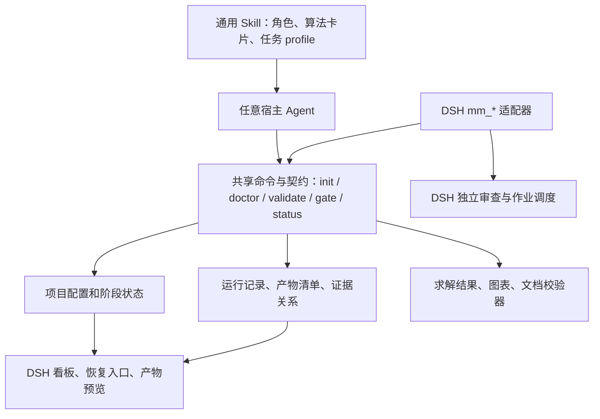

# 升级路线图：通用 Skill 核心 + DeepSeek Harness 增强

这份文件是实施设计，以下新目录、CLI 和契约尚未实现。基线是已同步的上游提交 `3c4bd1927663327812665941a445281b9c008a78`。

## 1. 产品定位

保留用户可直接加载的数学建模 Skill，重点提供可执行、可复核、可恢复的建模流程。宿主 Agent 负责推理与编排；通用工具负责确定性检查与证据记录；DSH 提供任务操作、状态和产物展示。

首版成功标准是：同一个题目项目能够被不同宿主读取和继续执行，阶段与证据一致，坏产物无法冒充完成，DSH 安装包可独立解析自己声明的资源。独立 Web 应用可作为后续选项，本轮定位没有要求它。

## 2. 目标架构



建议首先复用现有 Python 工具构建轻量 CLI，以 JSON 输入/输出作为宿主接口；DSH 的 JavaScript 负责工具注册、参数映射、会话身份和宿主权限。具体实现语言仍可在第一批契约定稿时调整，关键是只保留一套阶段和校验规则。

建议逐步演进的目录，保留兼容入口：

```text
SKILL.md                         # 简短总入口，仍可直接加载
references/roles/                 # 三角色知识和按需导航
assets/algorithms/               # 逐步拆分算法卡片与可执行示例
schemas/                         # 项目、运行、产物、门禁回执
runtime/                         # 通用状态/证据/校验与 CLI
profiles/                        # 竞赛、短任务、论文格式等配置
adapters/dsh/                    # DSH mm_* 与看板
tools/                           # 逐步整理原工具，保留兼容调用入口
scripts/build_distribution.py    # 同一源生成 Skill 包和 DSH 包
tests/                           # 单元、契约、分发、宿主集成测试
```

第一批修复仍在现有目录完成，待共享契约稳定后再移动文件；避免同时改逻辑、目录和安装方式而扩大回归范围。

## 3. 共享契约

| 契约 | 关键内容 | 要解决的问题 |
|---|---|---|
| 项目配置 | schema_version、project_id、任务范围、子问题、输出格式、规则来源、能力 profile | 单阶段/完整流程、多格式和不同宿主行为一致 |
| 运行记录 | run_id、输入/代码哈希、参数、种子、环境、argv/cwd、开始结束时间、退出码、日志、输出哈希 | 记录真正运行过什么，不能仅凭存在一个 .py 文件算完成 |
| 产物清单 | artifact_id、类型、所属子问题、实际路径、哈希、生成 run_id、校验结果 | 识别空文件、同一图多格式、资源变更和缺失 |
| 门禁回执 | gate_id、reviewer_id、审查来源/等级、reviewed_snapshot、status、findings、证据定位 | 独立审查与自检分开，阻止过期或冲突回执 |
| 项目状态 | revision、阶段、门禁、待办、阻塞、当前快照、完成状态 | 重启/多会话一致，失效可传播，写入不互相覆盖 |

继续使用现有 `.math-modeling/` 作为项目元数据目录，迁移旧 state 时先备份并记录版本。使用原子写入和并发版本控制；输入附件只读，输出遵守宿主批准的项目目录边界。

完成判定由当前任务范围、硬约束、真实校验和审查状态共同决定。缺独立审查可显示“产物已生成，独立验收未完成”；人工、外部独立 Agent、宿主 Subagent 的审查等级应明确标识。严格模式不能自动将自检升级为独立通过。

## 4. 实施顺序与验收

### 里程碑 A：现有版本可靠运行

优先小步修复，保持现有文件名、工具名和 Skill 加载入口。

| 建议变更单元 | 工作 | 验收标准 |
|---|---|---|
| A1 依赖与自动验证 | 依赖分组、Python/Node/宿主兼容声明；补 DOCX doctor；添加回归和打包检查 CI | 缺 defusedxml 等依赖时准确失败；支持的 Windows/Linux 环境自动运行现有测试；外部引擎缺失明确标记 |
| A2 复现合同修复 | DSH 接受真实 repro_manifest 输出；用 schema 校验类型、值、哈希 | 用实际 CLI 生成清单后能被插件接受；空值字段、伪哈希、缺命令被拒绝 |
| A3 门禁和交付修复 | 前置关系、P0/P1、审查来源和快照；调用真实检查器；增删改都触发失效 | W2 不能绕过依赖；空 DOCX/图片失败；产物变更后旧 PASS 和 completed 正确失效 |
| A4 DSH 状态修复 | session/project 绑定、显式根目录、并发保存、任务 reset、collab 解析 | 同时开两个题目不串状态；重启/切目录仍能续接；返回值与磁盘一致 |
| A5 完整发行包 | 同源构建 Skill/DSH 包；脚本、模板、资源引用检查；区分内置和外部依赖 | 包解压到含中文和空格的新路径且脱离源码仓库后，doctor 和最小工具链能执行 |

将本次 `probes/dsh-probes.mjs` 中确认的缺陷转成正式断言式回归测试；当前探针是证据收集脚本，不能仅以退出码 0 当成软件通过测试。

并行完成组件来源与许可清单，明确根项目及内置工具的可分发边界。未完成授权核实的组件不进入新的可分发完整包；可以先产出本地技术修复和分发设计。

### 里程碑 B：跨 Agent 共用一份项目

- 实现最小通用 CLI：项目初始化、能力诊断、状态读取、运行登记、交付验证、门禁记录、快照。命令名如 `mathmodel ...` 仅为提议，尚不可运行。
- 将独立模型/图表/论文规则迁入 profile，分清官方硬约束、用户明确要求和建议目标。
- 保留当前脚本入口作为兼容包装，让 DSH `mm_*` 委托同一运行时。
- 添加任务范围配置：只分析、只编程、只写论文、完整流程；输出格式支持用户选择，论文格式检查由该选择驱动。

验收：同一项目在通用 CLI 与 DSH 读取时，阶段、门禁、证据 ID 和哈希相同；重启会话后能继续；修改输入或代码只让相关下游证据/门禁失效；一个仅需两幅图的短任务 profile 能完成，而严格竞赛 profile 仍执行明确的硬约束。

### 里程碑 C：DSH 桌面专项增强

| 功能 | 对用户的价值 | 实现要点 |
|---|---|---|
| 能力与阻塞面板 | 开始前知道哪些环节可执行、缺什么 | 显示 doctor 的真实结果，提供有依据的下一动作 |
| 可恢复任务看板 | 看见当前阶段、失败原因及续跑入口 | 消费共享状态；以 project_id 隔离，不由 UI 另算完成 |
| 产物预览与证据定位 | 从结论定位到图、结果行、运行日志 | 按 artifact_id/run_id 关联；路径按宿主权限解析 |
| 独立审查入口 | 明确谁审查了哪个版本、为何失败 | 适配宿主 Subagent 生命周期，保存身份、快照与回执 |
| 截止时间快照 | 保留随时能交付的版本 | 快照不可被后续优化覆盖，恢复前展示影响范围 |
| 统一开关与安装标识 | 预设改名/重启后仍正常工作 | 从实际 preset 和宿主配置解析标识，开关只有一个来源 |

验收需要在**声明支持的 DSH 版本**上实际安装、挂载、重启、双会话切换、失败恢复和预览。模拟 ctx 测试不能替代这一阶段。

### 里程碑 D：形成可证明的建模质量优势

- 首批清理机器学习示例的数据泄漏、测试集调参和不成立的通用边界假设。
- 将算法文档拆成小卡片并配可执行示例：适用条件、输入结构、基线、验证、失败模式、依赖和来源。
- 用小型、来源明确且可分发的优化/预测/评价任务建立固定基准；记录数值容差、数据划分、输入/代码/输出哈希和运行预算。
- 将文献检索发现、元数据核验、原文对结论的支持分开；服务失败与零结果分别呈现。
- 用基准衡量改进：干净环境成功率、有效完成率、恢复成功率、证据覆盖、数值正确性和运行开销。

## 5. 上游同步与自己的维护方式

`origin` 保持你的仓库，`upstream` 保持原作者仓库。当前 `main` 已完成这次同步；后续改动在自己的功能分支提交，保留上游来源与贡献记录。

以后同步前先比较双方差异：若仍没有自己的 main 提交，可继续 fast-forward；自己的改进进入 main 后，应使用同步分支合并上游并跑回归，再合入自己的 main。不能长期使用强制覆盖引用的方式“同步”，否则会丢弃自己的改进历史。

第一批实施范围建议选择 A1–A5，交付一个“依赖准确、合同一致、门禁可验证、DSH 状态隔离、分发完整”的版本。待这些验收通过后，再扩展桌面交互和算法库，更容易证明这是一个具有独立价值的项目。
